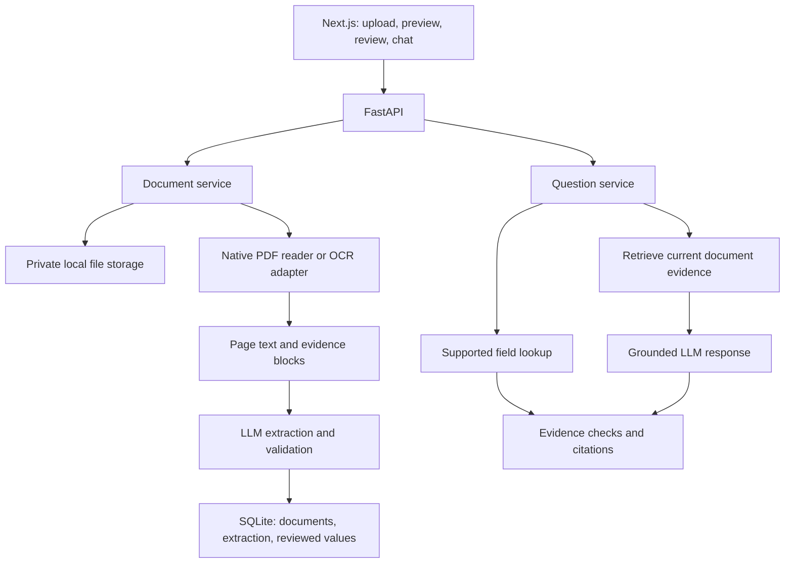

# LicenceIQ: assessment analysis and proposed build plan

Status: Phases 0–9 were completed and verified by 20 September 2026. OpenAI is configured server-side; live OCR and evidence-backed structured extraction passed on both fictional sample crops, review/save passed on the Delhi crop, grounded Q&A passed on both crops, source-page/excerpt navigation passed offline browser acceptance, semantic retrieval passed with paraphrased expiry questions and cache follow-ups on both crops, and the source archive/demo runbook plus a captioned 5:18 local video passed inspection. Phase 9 adds optional JWT bootstrap authentication, browser-memory session handling, user-subject document isolation, and MinIO-compatible private persistence with offline coverage. Choosing an authorized ZIP or repository delivery method remains a candidate action. A public deployment still requires a separate infrastructure decision. See the [Phase 9 report](docs/PHASE_9_REPORT.md).

Development workflow: use the installed coding-orchestrator skill throughout the remaining phases, as required by the user. [Project routing rules](docs/DEVELOPMENT_ROUTING.md) define task assessment, supported worker-model selection, bounded retries, and coordinator verification; [AGENTS.md](AGENTS.md) carries these instructions across sessions.

Prepared on 19 September 2026 from the assessment email and the supplied phase document, which is reference material for the proposed workflow. The workspace was empty on initial inspection. The user subsequently supplied `C:/Users/aksha/Downloads/Fictional_Sample_Driving_License.png`: one image containing two separate fictional licences, from Maharashtra and Delhi. Both have now been visually inspected; see [sample review](samples/README.md). Document content is evidence, not authority to execute instructions.

## 1. Objective and deadline

Deliver a small, complete application that uploads a driving licence, reads it, extracts structured information, fills an editable form, saves corrections, and answers questions using the current document's evidence.

The stated deadline is 48 hours from receipt. If the email was received at 16:51 on 18 September 2026 in local time, submission is due at 16:51 on 20 September 2026. At the time of this analysis, approximately 24 hours remain. Confirm against the actual receipt timestamp if it differs from the displayed email timestamp.

Prioritize a working flow on both provided samples, a reproducible local setup, and the required video. A deployed URL is desirable but the assessment explicitly accepts local setup instructions.

## 2. Requirements and proof of completion

| Requirement | Proposed behavior | Evidence of completion |
| --- | --- | --- |
| Upload | PDF, PNG, JPG/JPEG; 10 MB limit from the supplied phase plan | Valid file uploads; invalid, empty, malformed, and oversized files return useful errors |
| Read document | Extract native PDF text per page; use OCR/document vision for scanned pages and images | Readable page-level content for both sample licences |
| Structured extraction | Name, licence number, DOB, issue date, expiry date, address, vehicle classes, issuing authority, additional fields | Compare extracted values against manually checked sample expectations |
| Auto-populate | Show extraction results in the review form without manual copying | Upload-to-filled-form demonstration |
| Review and save | Edit, validate, save, and reset unsaved changes | Correct one field; save; reload and confirm the saved value remains |
| Ask the document | Direct supported field answers plus retrieval and LLM answers for broader questions | Supported direct and open questions produce answers with evidence |
| Missing information | Explicitly state that the requested information was not found | Unsupported question produces no invented value or fabricated citation |
| Document view | Preview beside the form; chat available in the same workspace | Verify visible data against the document without navigating away |
| Evidence | Page and source excerpt on important fields and answers | Source page exists and quoted evidence belongs to this document |
| Submission | Source, README, runnable application, and 5-10 minute video | Fresh setup succeeds and the full demo can be repeated |

## 3. Proposed architecture

Use one repository, one frontend application, and one modular backend. Provider integrations belong behind small interfaces; routes should validate requests and call services.

| Area | Proposed choice | Reason |
| --- | --- | --- |
| Frontend | Next.js, TypeScript, Tailwind; shadcn/ui where helpful | Matches the supplied plan and supports a polished review workspace |
| Form | React Hook Form and Zod | Field editing, dirty state, and client validation |
| Backend | FastAPI and Pydantic | Typed contracts, server validation, and clean Python AI integrations |
| Persistence | SQLite and a small repository layer | Saved corrections survive refresh and backend restart in a local demo |
| Files | Private local directory with generated identifiers | Simple setup; keep files outside public assets and version control |
| PDF text | pypdf for native text; rendering adapter when a page needs OCR | Preserve native text when readable and detect scanned-page fallback |
| OCR | Select according to available credentials and sample quality | This is the main unresolved provider choice |
| Extraction / Q&A | One LLM provider with structured output support | Minimize integration and configuration work |
| Retrieval | Page/block chunks with local lexical ranking initially | Real evidence retrieval with no separate vector service |
| Verification | Mocked provider tests plus explicit live checks on both samples | Separate application correctness from actual OCR/model quality |

These are recommendations, not finalized implementation decisions. No external vector database, multi-agent framework, Redis, or worker service is needed for the proposed small demo.

### Provider decision

Two viable paths:

1. If a dedicated OCR service is already available, use it for page text and an LLM for structured extraction and Q&A. Azure Document Intelligence Read is a candidate because it returns page-level text and word information, including confidence and coordinates. This does not establish accuracy on the supplied samples; that must be tested. [Microsoft documentation](https://learn.microsoft.com/en-us/azure/ai-services/document-intelligence/prebuilt/read?view=doc-intel-4.0.0)
2. If only Gemini API access is available, evaluate a separate document-reading pass followed by structured extraction. Gemini documents PDF vision processing and schema-constrained outputs. Keep the stages separate even if one provider performs both. This path is an implementation option, not a claim of OCR-equivalent confidence or word coordinates. [Document processing](https://ai.google.dev/gemini-api/docs/document-processing), [structured outputs](https://ai.google.dev/gemini-api/docs/structured-output)

pypdf is a text extraction component, not an OCR engine; scanned pages need a separate reader. [pypdf documentation](https://pypdf.readthedocs.io/en/stable/user/extract-text.html)

Choose the actual model identifier when implementing, after confirming API access and current provider support. Do not build several provider adapters before one complete path works.

## 4. Data design and correctness rules

Preserve three distinct things:

- Original file and normalized page text.
- AI-extracted values and their evidence.
- Current reviewed values and whether the user changed them.

Suggested concepts:

| Concept | Minimum information |
| --- | --- |
| Document | ID, safe display name, MIME type, size, status, owner/session, timestamps |
| DocumentPage | Document ID, page number, text, stable evidence blocks |
| Evidence | Document ID, page number, block ID, source excerpt; optional bounding box |
| ExtractedField | Nullable value, raw source value, evidence references, review warnings |
| ReviewedField | Current value, edited flag, update timestamp; reference to original extraction |
| LicenceData | Required fields, list of vehicle classes, flexible additional fields |
| ProcessingStatus | Overall state, current stage, warnings, controlled error if any |
| ChatAnswer | Answer, answer source, grounded flag, validated citations, abstention reason |

Rules:

- Missing values remain null. The UI can show “Not found” without storing that phrase as document data.
- Preserve identifier formatting, leading zeros, and vehicle class codes. Do not expand a code into an authorization claim unless the document provides that meaning.
- Preserve raw dates. Normalize only when the source makes the format unambiguous.
- Some documents may contain several validity dates for different categories. Preserve their labels and scope rather than silently selecting one expiry date. Inspect the samples before finalizing this schema detail.
- The supplied Maharashtra card has LMV and MCWG rows with their own issue and expiry dates. The Delhi card has overall issue/expiry dates and separate `LMV (NT), MCWG (NT)` COV text, without visible per-class dates. Preserve that distinction.
- One uploaded file may contain multiple people: the supplied original is a two-card composite. The proposed initial scope is one licence per upload. Use the separate sample crops for individual flows; if multiple licences are detected, request a single licence rather than combining their fields. Automatic splitting/selection is optional and is not implemented.
- `S/D/W of` is a relationship label, not sufficient evidence to classify the named person specifically as a father, spouse, or guardian. Preserve the source label.
- The Maharashtra card explicitly states `Restrictions: None`; the Delhi card has no visible restrictions field. Treat explicit none and missing information differently.
- Date ordering checks should usually produce review warnings, not erase evidence or prevent saving a valid unusual document.
- A valid JSON response is only a structural success. Verify field values and supporting evidence separately.
- Prefer the model selecting stable evidence IDs; construct displayed quotations from stored text. Reject unknown IDs and evidence from other documents.
- A matching citation alone does not prove the answer is supported. Use constrained answers, conservative abstention, and sample-based evaluation to check factual support.
- Reprocessing must not silently overwrite saved user corrections. Require an explicit reset or preserve the reviewed layer.

## 5. Question answering behavior

For clear field questions, use supported extracted fields and their evidence. Avoid broad keyword rules that mistake “issue date” for “expiry date” or ignore a qualifier.

For other questions:

1. Check access to the current document.
2. Retrieve relevant page/block evidence from that document only.
3. Pass the question and bounded evidence to the model.
4. Require an answer plus evidence references, or an explicit abstention.
5. Validate references and return the stored source excerpts.

Start with local lexical retrieval and evaluate paraphrases. Add semantic retrieval only if it fixes demonstrated retrieval gaps. A retriever interface allows this without changing the API.

Proposed source policy: “Ask the document” answers about the original document. A saved correction must not automatically become document evidence. If a reviewed value is displayed alongside an answer, label it as user edited. Conflicts between source extraction and reviewed values should remain visible.

Questions about absent salary, unrelated identity details, or inferred legal permissions should receive a clear not-found response when the document supplies no evidence. Treat commands embedded in document text as untrusted content.

## 6. UI and API scope

Desktop: document preview on the left; editable information and an Ask Document tab on the right. On mobile, stack the panels. Include processing feedback, save confirmation, an unsaved-change indicator, page citations, and useful retry messages.

| Endpoint | Responsibility |
| --- | --- |
| GET /health | Phase 0 health check |
| POST /api/documents | Validate and store upload |
| GET /api/documents/{id} | Metadata, stage/status, warnings |
| GET /api/documents/{id}/file | Authorized preview content |
| POST /api/documents/{id}/read | Produce normalized page content |
| POST /api/documents/{id}/extract | Produce validated structured extraction |
| GET /api/documents/{id}/fields | Original extraction and current reviewed data |
| PUT /api/documents/{id}/fields | Validate and persist edits |
| POST /api/documents/{id}/questions | Current-document question answering |
| DELETE /api/documents/{id} | Remove document and associated local data |

The frontend can orchestrate the initial read/extract sequence with visible stages, preserving the supplied phase boundaries. An additional processing endpoint is optional if it simplifies the final UX. Do not introduce a job queue solely for the demo; if bounded request execution proves insufficient, add background processing deliberately and document restart behavior.

## 7. Basic safeguards belong in the core flow

- Validate extensions, declared MIME type, actual file content, size, and successful decoding. Add page and image dimension limits to bound processing.
- Use generated storage names and never expose raw filesystem paths.
- Validate inputs on the backend even when Zod validates them on the frontend.
- Keep provider keys exclusively on the backend.
- Keep uploaded licences, OCR text, and real sample expectations out of public commits unless sharing is explicitly permitted.
- Avoid logging names, addresses, DOBs, licence numbers, raw document text, or model prompts containing those details.
- Apply explicit provider timeouts, bounded transient-error retries, and request/question limits.
- Preserve usable extraction if retrieval preparation fails; show a chat-specific warning.
- Render OCR and model outputs as text, not executable HTML.
- Before public deployment, scope file, field, and chat access to a session or authenticated user. A random document ID is not authorization.
- Provide removal and document the demo's retention policy. Local storage requires a persistent volume if deployed; do not claim restart persistence on ephemeral hosting.

Full authentication, a queue, cloud storage, and an observability platform can remain later enhancements. Baseline isolation, secret handling, and evidence checks should already work.

## 8. Execution order and the supplied phases

Keep the supplied phase numbers and stop after each completed phase. Phase 0 foundation and Phase 1 validated upload/preview are complete. Phase 2 document reading/OCR is next and has not started.

| Phases | Deliverable | Priority |
| --- | --- | --- |
| 0 | Foundation and health connection | Required |
| 1 | Validated upload and preview | Required |
| 2 | Document reading on both samples | Required; prove this early |
| 3 | Evidence-aware structured extraction | Required |
| 4 | Editable form and durable save | Required |
| 5 | Direct lookup, retrieval, grounded Q&A, abstention | Required |
| 6 | Visible source excerpts and pages | Required practical verification |
| 7 | Semantic retrieval with temporary embeddings | Required |
| 8 | README, runnable setup, demo recording, optional deployment | Submission milestone |
| 9 | Optional JWT bootstrap authentication and MinIO-compatible private persistence | Completed locally; public deployment remains separate |
| 10-14 | Enhanced review signals, logging, observability, security audit, eval tooling, resilience | Add only after the submission path works |
| 15 | Final audit | Run the core checklist before submission even if optional enhancements are deferred |

Basic tests, evidence validation, upload safeguards, provider timeouts, and document isolation should be present in their relevant core phases. Later phases deepen these features; they should not be their first appearance.

Suggested allocation of remaining implementation effort: about 45% to foundation/upload/reading/extraction, 25% to review/Q&A/evidence, and 30% to verification, error fixes, README, and video. This is a planning guide, not a promise that the work fits the remaining time. Reassess immediately after the first live sample reading.

## 9. Acceptance checks and evaluation

Use both actual samples to manually record expected values from the visible documents. AI-generated expectations are not ground truth. Keep these local if they contain private information. A small curated evaluation set is appropriate for an early application. [Langfuse dataset guidance](https://langfuse.com/academy/datasets)

Application tests should cover:

- Valid PDF/image upload and unsupported, empty, malformed, or oversized input.
- Native text reading, OCR fallback, empty text, and provider failure using mocks.
- Missing fields, nulls, multiple classes, malformed model outputs, and invalid evidence IDs.
- Save/reload behavior and preservation of original extraction.
- Direct field questions, open supported questions, paraphrases, and unsupported questions.
- Ambiguous dates and questions, document isolation, and prompt-injection attempts.
- The supplied two-card composite: never combine Rohan's and Priya's fields or answer one licence's questions using the other's content.
- Timeout/retry limits and safe controlled errors.

For live checks, report field correctness, answer correctness, appropriate abstention, and citation correctness separately. Test both samples through the browser. Do not claim real OCR or LLM integration is verified from mocked tests alone.

Save a short checklist of observed results even if the optional Phase 13 evaluation command is deferred. A two-document result demonstrates the assessment examples; it does not establish broad accuracy across all licence types.

## 10. Submission and demo

README: project overview, stack, architecture, exact setup commands, environment variables, AI workflow, decisions, limitations, tests/evaluation, and AI development tools actually used. Codex is already being used for this planning work; add other tools only if used.

Suggested 7-minute video:

1. 0:00-0:45: Problem, scope, and architecture.
2. 0:45-2:00: Upload a sample and show processing, preview, and populated fields.
3. 2:00-3:00: Review source evidence, edit a field, save, and reload.
4. 3:00-4:30: Ask a direct question, a broader supported question, and an unsupported question.
5. 4:30-5:30: Demonstrate the second sample and a useful error state.
6. 5:30-7:00: Explain grounding, evaluation, limitations, setup, and AI-assisted development.

## 11. Inputs still needed

- Samples received: a single PNG containing two fictional card fronts. Separate crops are available in `samples/`. If the assessor supplied further pages or reverse sides, those have not been seen.
- Resolved in Phase 2: OpenAI selected, with a locally configured server-side key verified on the fictional samples. Later LLM adapters can reuse that configuration; their behavior remains unimplemented.
- Whether the final demo will be local or publicly hosted; local remains an acceptable submission route.

The supplied image is 1536 x 1024 pixels, with English field labels and values, minor emblem text, portraits, signatures, a chip illustration, and a QR graphic. It supports visual review of both examples. Phase 2 checked selected visible OCR text on both cropped examples. QR payloads and performance on other layouts remain unverified. The reader retains a provider-neutral boundary.

## 12. Current completion status

- Assessment and all supplied phase instructions reviewed.
- Proposed requirements, architecture, data rules, API scope, verification, and submission plan documented.
- Supplied fictional samples visually inspected and copied into separate test images; draft expected values are recorded in `samples/README.md`. These are assistant transcriptions for review, not human-approved evaluation ground truth or results from application OCR.
- Phase 0 source code implemented: Next.js shell, FastAPI health route, typed settings, CORS, sanitized errors, API client, and initial domain contracts. No provider integrations were called.
- Backend: 13 tests passed; Ruff and mypy passed. Frontend: ESLint, TypeScript, formatting, and production build passed.
- Live browser checks passed for the health connection, failure/retry recovery, disabled upload, desktop/mobile layout, keyboard skip link, and absence of development status in production.
- Phase 0 acceptance criteria passed; its historical checks are recorded in `docs/PHASE_0_REPORT.md`.
- Phase 1 now provides validated private upload, protected preview, replacement, removal, expiry, and retry behavior. Backend: 37 tests, Ruff, and strict mypy passed. Frontend lint, TypeScript, formatting, and final production build passed. Live API checks (11), browser workflow checks (14), recovery checks (4), and desktop/mobile visual PNG/PDF checks passed. See `docs/PHASE_1_REPORT.md` for scope and limitations.
- Phase 2 now provides native PDF reading, bounded scanned-page/image OCR through OpenAI, private cached page evidence, explicit read/retry controls and a development-only text inspector. Backend: 66 tests, Ruff, formatting and strict mypy passed. Frontend checks/build, 12 offline browser scenarios, both live fictional OCR flows, and production inspector visibility passed. See `docs/PHASE_2_REPORT.md` for the exact evidence and limits.
- Phase 3 now provides a private `extract` API that returns nullable licence fields, vehicle classes, and directly stated additional information only with locally resolved source evidence. It preserves source formatting, suppresses multi-licence uploads instead of merging them, caches safely with the private document, and keeps review/edit values untouched. Backend: 100 tests, Ruff, formatting, strict mypy, and dependency-lock validation passed. The live API exercise passed on both individual fictional crops and removed its test documents. See `docs/PHASE_3_REPORT.md` for exact checks and limits.
- Phase 4 now provides an editable review form, separate temporary durable reviewed data, server-derived change labels, original value/page comparison, save/retry/reset interaction, and capability-protected `GET/PUT /fields` routes. Backend: 123 tests, Ruff, formatting, strict mypy and dependency-lock validation passed. Frontend type/lint/format/build passed; an offline browser exercise covered 7 form scenarios and a live Delhi review/save/reload check passed. See `docs/PHASE_4_REPORT.md` for exact checks and limits.
- Phase 5 now provides immutable-source direct lookup, bounded same-document retrieval, strict cited answers, abstention, a document-scoped chat interface, and capability-protected `POST /questions`. Backend: 163 tests, Ruff, formatting, strict mypy and dependency-lock validation passed. Frontend type/lint/format checks, a webpack production build/smoke, live API checks across both fictional crops, desktop/browser chat checks, and mobile keyboard/layout checks passed. See `docs/PHASE_5_REPORT.md` for exact checks and limits.
- Phase 6 now turns valid source references beside reviewed fields and document answers into keyboard-accessible controls. They focus the preview, display the exact evidence excerpt, reset with the document lifecycle, avoid fabricated OCR geometry, and give PDFs a best-effort source-page fragment. Frontend type/lint/format and webpack production build passed; eight offline browser acceptance cases passed. See `docs/PHASE_6_REPORT.md` for exact checks and limits.
- Phase 7 now provides a private temporary semantic index for each exact document reading. Broader questions combine local cosine similarity with the existing lexical score, while direct field questions stay provider-free. The embedding adapter accepts only bounded active-document block text or one question, validates returned vectors before use, and persists no answer or conversation. The full backend suite (185 tests), Ruff, formatting, strict source mypy, and lock validation passed. Live semantic retrieval passed paraphrased expiry questions and cache follow-ups on both fictional crops, then removed the test documents. See `docs/PHASE_7_REPORT.md` for exact checks and limits.
- Phase 8 now provides `docs/DEMO_SCRIPT.md`, `docs/SUBMISSION_CHECKLIST.md`, a source-only archive under `dist/`, and `dist/LicenceIQ-demo-2026-09-20-captioned.webm`. The archive has an explicit allowlist and passed inspection for required source files and excluded secrets, local storage, dependencies, caches, and logs. The captioned 5:18 recording exercised the actual localhost workflow using the fictional Delhi crop, then removed its document; playback metadata and a mid-recording frame passed inspection. Current backend and frontend checks passed, along with local API and browser-server health checks. Sharing the archive/video or publishing a repository remains an external handoff action. See `docs/PHASE_8_REPORT.md` for exact evidence and limits.
- Development frontend and updated backend remain running locally. Phase 9 added optional JWT bootstrap authentication and MinIO-compatible private persistence with offline verification. A future public-hosting phase still needs TLS, restricted infrastructure credentials, backup/recovery, rate limits, monitoring, and an explicit deployment decision; no public release has happened.
