# LicenceIQ

A workspace for reading, reviewing, and understanding driving licences.

**Current milestone: Phase 9 — private deployment foundation complete.** Upload one driving licence as PDF, PNG, JPG, or JPEG and choose **Read document**. Native PDF text is read locally; images and scanned pages use OpenAI. The workspace extracts source-backed fields, places them in an editable form beside the document, saves reviewer corrections separately from the original extraction, answers questions from immutable document evidence, uses a private per-document semantic index for broader paraphrased questions, and lets a reviewer open the cited page and exact evidence excerpt. The page contains no fabricated licence data. The verified Phase 8 source ZIP and captioned 5:18 demo video remain ready locally. Phase 9 adds optional JWT account access and MinIO-compatible private persistence without publishing the application.

Development follows the [coding-orchestrator workflow](docs/DEVELOPMENT_ROUTING.md), with project instructions in [AGENTS.md](AGENTS.md). Independent coding tasks are routed by complexity and risk to supported worker models, with coordinator review and verification.

## Assessment requirement coverage

LicenceIQ implements the complete local workflow requested in the technical
assessment. It is deliberately scoped to one driving licence per upload; the
included Maharashtra and Delhi fictional samples are separate files in
[`samples/`](samples/).

| Assessment requirement | LicenceIQ implementation |
| --- | --- |
| Upload document | Accepts one PDF, PNG, JPG, or JPEG driving licence after size, MIME type, structure, and image-decode validation. |
| Read and extract | Reads native PDF text locally and uses OpenAI vision OCR for images or scanned PDF pages. It extracts nullable, source-backed licence fields. |
| Auto-populate form | Loads supported values into the review form: name, licence number, date of birth, issue and expiry dates, address, vehicle classes, issuing authority, and other directly supported fields. |
| Review and edit | Saves reviewer corrections separately from immutable source extraction, preserving the original value and its evidence. |
| Ask the document | Answers direct and broader questions only from the active document's evidence. Unsupported questions return an explicit unavailable response rather than an invented answer. |
| Document and data view | Displays the document, reviewed data, question panel, source page, and exact evidence excerpt in one workspace. |
| RAG and source grounding | Uses bounded same-document semantic-plus-lexical retrieval for paraphrased questions, validates cited evidence IDs locally, and never uses another document's content. |
| Security and error handling | Keeps provider keys server-side; protects documents with an in-memory capability or optional JWT ownership; validates uploads; expires temporary data; and returns controlled errors. |

### Quick reviewer workflow

1. Start the backend and frontend, then open `http://127.0.0.1:3000`.
2. Upload one individual fictional sample from `samples/`.
3. Choose **Read document** to run reading and source-backed extraction.
4. Compare the populated form with the preview, edit a field if needed, and choose **Save review**.
5. Ask a direct question, a paraphrased question, and an unsupported question; inspect each available citation.
6. Choose **Remove document** when finished.

## Run locally

Prerequisites: Python 3.11+, [uv](https://docs.astral.sh/uv/), and Node.js 22.13+ LTS or 24 LTS with npm. The toolchain also accepts Node.js 20.19+, but the older system Node.js 20.11 does not meet every development dependency's engine requirement. This project keeps frontend and backend dependencies isolated and includes lockfiles.

Run the following from the repository root in PowerShell. Environment files are optional for the default local addresses:

```powershell
Copy-Item .env.example .env
Copy-Item frontend/.env.example frontend/.env.local
```

Do not overwrite existing local environment files when repeating setup.

**Terminal 1 — backend:**

```powershell
cd backend
uv sync --frozen --python 3.11
uv run uvicorn app.main:app --reload --host 127.0.0.1 --port 8000
```

**Terminal 2 — frontend:**

```powershell
cd frontend
npm.cmd ci
npm.cmd run dev
```

Open [LicenceIQ](http://127.0.0.1:3000). In development, the header should show **Backend connected**. This is a real browser request to FastAPI, not a simulated status. If the backend is unavailable, start it and choose **Retry**.

- API health: [http://127.0.0.1:8000/health](http://127.0.0.1:8000/health)
- Development API docs: [http://127.0.0.1:8000/docs](http://127.0.0.1:8000/docs)
- Stop either foreground server with Ctrl+C in its terminal.
- If a port is occupied, use a different port and update the API URL/CORS origins accordingly. Do not stop an unrelated application.

The runtime fonts are packaged locally; opening or building the app does not require Google Fonts access. Package installation does require registry access. On macOS/Linux, use `npm` in place of `npm.cmd`.

## Environment variables

| Variable | File | Default / purpose |
| --- | --- | --- |
| `OPENAI_API_KEY` | Root `.env` | Server-only OpenAI key; required for image/scanned-page OCR, optional for native PDF text |
| `LICENCEIQ_OCR_MODEL` | Root `.env` | `gpt-4.1-mini`; configurable image-capable model supporting structured outputs |
| `LICENCEIQ_OCR_TIMEOUT_SECONDS` | Root `.env` | `45`: maximum timeout for a provider request; no SDK retries |
| `LICENCEIQ_READING_TIMEOUT_SECONDS` | Root `.env` | `120`: reading deadline checked between stages and passed to provider calls |
| `LICENCEIQ_OCR_MAX_IMAGE_DIMENSION` | Root `.env` | `2400`: maximum prepared image width/height |
| `LICENCEIQ_OCR_MAX_IMAGE_PIXELS` | Root `.env` | `4000000`: maximum prepared image pixels |
| `LICENCEIQ_MAX_READING_CHARACTERS` | Root `.env` | `200000`: total page text output bound |
| `LICENCEIQ_EXTRACTION_MODEL` | Root `.env` | `gpt-4.1-mini`; model used for schema-constrained structured extraction |
| `LICENCEIQ_EXTRACTION_TIMEOUT_SECONDS` | Root `.env` | `60`: deadline for one structured extraction request |
| `LICENCEIQ_EXTRACTION_MAX_INPUT_CHARACTERS` | Root `.env` | `200000`: maximum cached reading text supplied to extraction |
| `LICENCEIQ_EXTRACTION_MAX_OUTPUT_TOKENS` | Root `.env` | `4000`: maximum structured-output response budget |
| `LICENCEIQ_QUESTION_MODEL` | Root `.env` | `gpt-4.1-mini`; model used for grounded broader questions |
| `LICENCEIQ_QUESTION_TIMEOUT_SECONDS` | Root `.env` | `60`: total time for semantic retrieval and one grounded answer |
| `LICENCEIQ_QUESTION_MAX_INPUT_CHARACTERS` | Root `.env` | `50000`: bound for serialized selected question evidence |
| `LICENCEIQ_QUESTION_MAX_OUTPUT_TOKENS` | Root `.env` | `1000`: strict answer-output budget |
| `LICENCEIQ_QUESTION_MAX_SELECTED_BLOCKS` | Root `.env` | `8`: maximum same-document blocks selected for a broader question |
| `LICENCEIQ_QUESTION_MAX_SELECTED_CHARACTERS` | Root `.env` | `16000`: maximum selected reading characters |
| `LICENCEIQ_QUESTION_EMBEDDING_MODEL` | Root `.env` | `text-embedding-3-small`: server-side model for temporary semantic retrieval |
| `LICENCEIQ_QUESTION_EMBEDDING_DIMENSIONS` | Root `.env` | `256`: bounded dimensions for each temporary vector |
| `LICENCEIQ_QUESTION_EMBEDDING_TIMEOUT_SECONDS` | Root `.env` | `15`: maximum time for each embeddings request |
| `LICENCEIQ_QUESTION_EMBEDDING_MAX_BLOCKS` | Root `.env` | `256`: maximum active-document reading blocks indexed |
| `LICENCEIQ_QUESTION_EMBEDDING_MAX_CHARACTERS` | Root `.env` | `100000`: maximum active-document reading text indexed |
| `LICENCEIQ_MAX_CONCURRENT_QUESTIONS` | Root `.env` | `4`: process-local concurrent question limit |
| `LICENCEIQ_APP_NAME` | Root `.env` | `LicenceIQ API`; API title |
| `LICENCEIQ_ENVIRONMENT` | Root `.env` | `development`; accepts `development`, `test`, `production` |
| `LICENCEIQ_AUTH_MODE` | Root `.env` | `capability` for the local demo, or `jwt` for a signed-in workspace |
| `LICENCEIQ_JWT_SIGNING_KEY` | Root `.env` | Server-only random key of at least 32 bytes; required in JWT mode |
| `LICENCEIQ_JWT_ISSUER`, `LICENCEIQ_JWT_AUDIENCE`, `LICENCEIQ_JWT_ACCESS_TOKEN_TTL_SECONDS` | Root `.env` | Fixed JWT claims and 15-minute default expiry |
| `LICENCEIQ_BOOTSTRAP_USERNAME`, `LICENCEIQ_BOOTSTRAP_PASSWORD_HASH`, `LICENCEIQ_BOOTSTRAP_SUBJECT` | Root `.env` | Server-only initial account identity and Argon2 hash; required in JWT mode |
| `LICENCEIQ_CORS_ORIGINS` | Root `.env` | JSON array containing `http://localhost:3000` and `http://127.0.0.1:3000` |
| `LICENCEIQ_DOCUMENT_STORAGE_BACKEND` | Root `.env` | `filesystem` for local demo/tests or `minio` for private S3-compatible persistence |
| `LICENCEIQ_DOCUMENT_STORAGE_DIR` | Root `.env` | Optional absolute private directory; defaults to `backend/.data/documents` |
| `LICENCEIQ_MINIO_ENDPOINT`, `LICENCEIQ_MINIO_ACCESS_KEY`, `LICENCEIQ_MINIO_SECRET_KEY` | Root `.env` | Server-only MinIO host:port and dedicated private-bucket credential |
| `LICENCEIQ_MINIO_BUCKET`, `LICENCEIQ_MINIO_PREFIX`, `LICENCEIQ_MINIO_SECURE` | Root `.env` | Private bucket, generated-key namespace, and TLS setting for the MinIO client |
| `LICENCEIQ_MAX_UPLOAD_FILE_BYTES` | Root `.env` | `10485760`: 10 MiB, displayed as 10 MB |
| `LICENCEIQ_MAX_UPLOAD_REQUEST_BYTES` | Root `.env` | `11534336`: 11 MiB including multipart overhead; must exceed the file limit |
| `LICENCEIQ_DOCUMENT_RETENTION_SECONDS` | Root `.env` | `86400`: document access expires after 24 hours |
| `LICENCEIQ_MAX_PDF_PAGES` | Root `.env` | `20`: maximum accepted PDF pages |
| `LICENCEIQ_MAX_IMAGE_DIMENSION` | Root `.env` | `12000`: maximum image width or height in pixels |
| `LICENCEIQ_MAX_IMAGE_PIXELS` | Root `.env` | `40000000`: maximum image pixel count before decoding |
| `NEXT_PUBLIC_API_BASE_URL` | `frontend/.env.local` | `http://127.0.0.1:8000`; public browser API address |
| `NEXT_PUBLIC_AUTH_MODE` | `frontend/.env.local` | `capability` or `jwt`; this is a public non-secret mode switch |

Backend environment variables override the root environment file. The backend finds that file relative to its source location, not the terminal's working directory. Frontend environment variables follow Next.js loading rules. Restart the relevant server after changing settings. `NEXT_PUBLIC_*` values are public and are embedded at build time; never place a provider key there.

Capability mode needs no account and preserves the recorded local assessment flow. JWT mode presents a bootstrap login and holds its short-lived bearer token only in React memory; it is never placed in browser storage, a URL, or a document response. Put your OpenAI key in `OPENAI_API_KEY=` in the ignored root `.env`, then restart the backend. Never paste provider, MinIO, JWT, or bootstrap-account values into chat, source code, frontend settings, or screenshots. Production frontend builds omit both the development health indicator and raw-text inspector. Production backend settings reject capability mode, filesystem storage, non-HTTPS CORS origins, and incomplete JWT/MinIO values. The UI displays the default 10 MB and 24-hour limits; update the UI copy and client checks as well if changing these defaults for a deployment. See [the Phase 9 local setup guide](docs/PHASE_9_LOCAL_SETUP.md) to prepare a private MinIO/JWT instance.

## Technology stack

- Next.js App Router, React, TypeScript, Tailwind CSS.
- Locally packaged Inter and Open Sans fonts.
- FastAPI, Pydantic, pydantic-settings, Uvicorn.
- python-multipart for file intake, Pillow for complete image validation, and pypdf for PDF structure/page checks.
- pypdfium2 for bounded rendering of scanned PDF pages; the OpenAI Python SDK for vision transcription, structured extraction, grounded answers, and temporary embeddings.
- Backend quality checks: pytest, Ruff, mypy.
- Frontend quality checks: ESLint, TypeScript, Next.js production build.

Exact dependency resolutions are in `frontend/package-lock.json` and `backend/uv.lock`.

## Architecture

```mermaid
flowchart LR
    Browser[Upload, preview and read workspace] --> Client[Typed API client]
    Client --> API[FastAPI document routes]
    API --> Service[Validation and document lifecycle]
    Service --> Validation[Image decode or PDF structure check]
    Service --> Storage[Private files and metadata]
    Client -->|Document capability header| API
    API --> Preview[Validated original bytes]
    Preview --> Blob[Temporary browser preview URL]
    API --> Reader[Page reader]
    Reader --> Native[Native PDF text]
    Reader --> Raster[Prepared image or rendered PDF page]
    Raster --> OCR[OpenAI OCR adapter]
    Native --> Pages[Page text and evidence blocks]
    OCR --> Pages
    Pages --> Storage
    Pages --> Extractor[Structured extraction service]
    Extractor --> LLM[OpenAI strict JSON adapter]
    LLM --> Candidates[Value and block-ID candidates]
    Candidates --> Grounding[Local evidence validation]
    Grounding --> Storage
    Client --> Review[Review and save form]
    Review --> API
    API --> ReviewStore[Reviewed values beside extraction]
    ReviewStore --> Storage
    Client --> Questions[Ask this document]
    Questions --> API
    API --> AnswerService[Grounded question service]
    Pages --> AnswerService
    Grounding --> AnswerService
    Pages --> SemanticIndex[Private temporary semantic index]
    AnswerService --> SemanticIndex
    AnswerService --> Embeddings[OpenAI Embeddings adapter]
    Embeddings --> SemanticIndex
    AnswerService --> AnswerLLM[OpenAI strict JSON adapter]
    AnswerLLM --> AnswerValidation[Citation validation]
    AnswerValidation --> Questions
```



One repository contains a frontend and a modular Python backend. The workspace root is the project root; an extra nested `licence-iq` folder is unnecessary.

```text
backend/
  app/
    main.py               Application factory and middleware
    api/                  Health and document upload/read/delete routes
    core/                 Typed settings and error handling
    models/               Document, reading and evidence contracts
    schemas/              Public health and error envelopes
    services/             Validation, temporary lifecycle and page reading
  providers/            OCR/extraction protocols and OpenAI adapters
    repositories/         Private generated file keys and metadata sidecars
    prompts/              Reserved for later prompts
  tests/                  Offline foundation, lifecycle and provider checks
  pyproject.toml
  uv.lock
frontend/
  src/app/                Page, layout, design tokens, responsive styles
  src/components/         Upload/preview workspace, icons, health indicator
  src/lib/                Public environment settings and API client
  src/types/              Matching frontend document contracts
samples/                  Two fictional licence crops and review notes
docs/                     Phase completion notes
```

OCR transcription, extraction, and grounded-answer instructions live with their provider adapters. The prompts package remains available for later prompt-management work.

## Initial domain contracts

- `Document`: safe metadata, type, size, creation time, state, optional page count.
- `DocumentPage`: page number, normalized text, evidence blocks.
- `Evidence`: source document ID, one-based page number, excerpt, optional block ID, confidence and bounding box. OpenAI transcription has no reliable confidence or coordinates, so these remain null.
- `ReadingResult`: document ID, reading status, pages, warnings and creation time. Reading is separate from completed licence extraction.
- `ExtractedField`: nullable extracted value, source-formatted raw value, immutable evidence, reserved reviewed value, edited flag, warnings.
- `ExtractedLicence`: nullable required fields, multiple vehicle classes, and additional supported fields.
- `ExtractionResult`: immutable cached result with an extraction status, warnings, and creation time.
- `FieldsResult`: immutable source extraction plus separate current reviewed values and a review-save timestamp.
- `QuestionResult`: an ephemeral answered or unavailable response with immutable-source page/block citations when answered.
- `SemanticIndex`: private, validated numeric vectors for one exact document reading and embedding configuration; it is never returned by the API.
- `ProcessingStatus`: `UPLOADED`, `PROCESSING`, `READY`, `READY_WITH_WARNINGS`, `FAILED`.

Upload metadata uses `Document`; Phase 2 uses page/evidence and reading contracts; Phase 3 uses the extraction contracts; Phase 4 adds a separate reviewed layer; Phase 5 adds ephemeral grounded answers; Phase 6 adds browser-only source focus state; and Phase 7 adds a temporary private semantic index. Extraction `current_value` remains null and `is_edited` false forever. The reviewed layer derives its own `current_value` and server-derived edit flag without changing the source value or evidence. Questions use the original extraction and reading only; they never turn reviewer values into document evidence.

## API and error handling

`GET /health` returns HTTP 200:

```json
{"status":"ok"}
```

Liveness does not imply that OCR or AI integrations are available. The frontend validates API responses, bounds ordinary requests to ten seconds and document reading to 135 seconds, handles cancellation, and provides safe connection messages.

| Endpoint | Result |
| --- | --- |
| `POST /api/auth/login` | JWT mode only: exchange the configured bootstrap credentials for one short-lived bearer token |
| `POST /api/documents` | Multipart field `file`; HTTP 201 with `Document` metadata and a one-time `access_token` only in local capability mode |
| `GET /api/documents/{document_id}` | Client-safe document metadata |
| `GET /api/documents/{document_id}/file` | Validated original bytes for preview |
| `POST /api/documents/{document_id}/read` | Read and cache page text, or return an existing successful reading |
| `GET /api/documents/{document_id}/reading` | Retrieve saved page text; missing reading returns `READING_NOT_FOUND` |
| `POST /api/documents/{document_id}/extract` | Extract, evidence-check, and cache nullable licence fields; a cached result is returned on repeat calls |
| `GET /api/documents/{document_id}/extraction` | Retrieve a saved extraction; a missing result returns `EXTRACTION_NOT_FOUND` |
| `GET /api/documents/{document_id}/fields` | Retrieve immutable extraction plus derived or saved reviewer values |
| `PUT /api/documents/{document_id}/fields` | Validate and save one complete reviewed form without altering source extraction |
| `POST /api/documents/{document_id}/questions` | Answer one question from immutable source evidence with page/block citations or a safe unavailable response |
| `DELETE /api/documents/{document_id}` | Removes stored bytes, reading and metadata; HTTP 204 |

In capability mode, existing-document operations require `Authorization: Bearer <access_token>`. A random document ID alone grants no access. The server stores a hash of each generated capability; the frontend keeps it only in memory and fetches preview bytes with a header, never a token URL. Missing/wrong capabilities and unknown documents return the same 404 error. In JWT mode, upload and every document operation require a signed bearer token. The document stores its token subject, and a different subject receives the same 404 response as an unknown document. Login failures and invalid tokens produce a generic 401 response. The browser clears its in-memory JWT when it expires, on sign-out, or after any 401 response.

Files must have a supported extension, matching declared MIME type, and valid content. Image validation decodes the image; PDF validation inspects structure and pages. Empty, malformed, spoofed, oversized, encrypted, and over-limit documents are rejected. The request body is bounded before multipart parsing can consume unbounded input. Validation is not malware scanning or proof that a document is authentic.

Choose a file or drop it onto the document panel, then choose **Upload document**. Replacement keeps the old preview if the new upload fails, and removes the old server file after the replacement is ready. Cleanup failures have a retry action. **Remove document** calls the server; a failed removal leaves the preview visible with an error. Refreshing starts a new workspace because access capabilities are not retained in browser storage.

Stored documents expire after 24 hours by default. Best-effort cleanup runs at API startup and document operations; there is no background cleanup while the API is stopped. Expired access is denied even if deletion fails. The ignored private `.data` directory is outside frontend public assets. A process crash can leave orphan files requiring operator cleanup; this is temporary demo storage, not durable reviewed-data persistence.

Errors use a common envelope:

```json
{
  "error": {
    "code": "INVALID_REQUEST",
    "message": "The request contains invalid or missing information."
  },
  "request_id": "server-generated-uuid"
}
```

Each request receives `X-Request-ID`. Unexpected application exceptions expose only a generic message; the application logs their type and request ID, not exception text or request bodies. CORS allows configured origins and GET, POST, PUT, DELETE with the required headers. CORS is a browser policy, not authorization.

## Checks

From `backend/`:

```powershell
uv run pytest
uv run ruff check app tests --no-cache
uv run mypy app
```

From `frontend/`:

```powershell
npm.cmd run lint
npm.cmd run typecheck
npm.cmd run format:check
npm.cmd run build
```

For a production frontend preview after building:

```powershell
npm.cmd run start
```

Stop the development frontend first if it uses the same port. The development health indicator should be absent in this production preview. Automated backend checks use isolated temporary directories and generated files; no AI calls or paid services are used.

## Submission package

The source code, setup instructions, fictional samples, architecture, and phase reports are included in this repository. A 5:18 captioned localhost walkthrough using the fictional Delhi crop is prepared separately for the assessment delivery; binary recordings are intentionally excluded from Git. The [demo script](docs/DEMO_SCRIPT.md) and [submission checklist](docs/SUBMISSION_CHECKLIST.md) explain the flow and delivery review. Include the video file or an authorized video link alongside the repository when submitting. Deploy only after suitable public-hosting safeguards are in place. The detailed package evidence is in the [Phase 8 report](docs/PHASE_8_REPORT.md).

## AI approach and decisions

Phase 2 tries native text for every PDF page. A page needs at least 40 alphanumeric characters and an 80% printable/non-control ratio; otherwise the page is rendered and sent for OCR. This heuristic can miss incomplete text layers, so visual review remains necessary. Images are oriented using EXIF, converted to RGB and resized before sending. PDFium operations are serialized because its native library is not thread-safe.

The OpenAI OCR adapter sends prepared page images as data URLs with strict `lines` JSON output, no tools, `store=False`, a bounded output budget and no automatic SDK retries. Instructions require transcription, preserve printed values and treat visible document instructions as source material. Pages and block IDs are assigned locally. Refusals, truncated/malformed output, empty documents and service errors are handled explicitly. `store=False` does not promise zero retention by the provider; see [OpenAI data controls](https://developers.openai.com/api/docs/guides/your-data). Model support is documented on the [GPT-4.1 mini model page](https://developers.openai.com/api/docs/models/gpt-4.1-mini).

Phase 3 sends only the cached page/block text to a separate OpenAI Responses adapter. It asks for strict JSON candidates containing source-formatted values and block IDs, with no tools, no SDK retries and `store=False`. The backend resolves those IDs against its own reading cache; it does not trust provider-supplied excerpts or pages. A field is exposed only when both its value and raw value are supported by the cited source text after conservative spacing/punctuation normalization. Unsupported values become null with a safe warning; unknown or cross-document block IDs fail the request. If distinct licence holders or licence numbers are detected, every field is suppressed rather than merged. This follows the [OpenAI Structured Outputs guide](https://developers.openai.com/api/docs/guides/structured-outputs); schema-valid JSON is still checked against local evidence.

Reading is an explicit user action because images and scanned pages are sent to OpenAI and incur API usage. The workspace then runs cached extraction and loads the review form. Successful readings, extractions, reviewed values, and a matching temporary semantic index are cached with the private document; deletion and expiry remove all four. In development, expand the raw-text inspector to compare each page with the preview. Review corrections are user-entered values, never substituted document evidence.

Direct field questions are answered from already evidence-backed immutable extraction values and never invoke an embeddings or answer provider. For broader questions, Phase 7 builds or reuses a bounded index of active-document reading blocks with `text-embedding-3-small`, embeds the one question, calculates cosine similarity locally, and combines that score with the existing lexical score deterministically. The embedding adapter receives only the bounded block text or question, uses no SDK retries, and validates vector count, dimensions, finiteness, and source order before use. The answer adapter receives only the bounded selected blocks and question, returns `ANSWERED` only with cited block IDs or a fixed unavailable result, and uses no tools, no SDK retries, and `store=False`. The backend resolves cited IDs against the selected reading blocks before returning source pages; it rejects unknown, duplicate, uncited, cross-document, malformed, oversized, or late results. Neither provider receives a document capability, file URL, reviewer value, browser transcript, or unrelated document text.

Phase 6 turns source-page references beside extracted fields and cited answers into accessible controls. A valid control resolves only to the active reading, focuses the document preview, and displays the exact stored source excerpt. Image previews receive an honest focused-source state; PDF previews receive a best-effort `#page=<n>` fragment. OCR geometry is usually unavailable, so the app does not draw fabricated pixel boxes over a document.

The initial provider-neutral models avoid tying the application to a vendor. Separate extracted and reviewed values protect provenance. A small modular backend keeps orchestration in services and provider SDKs in adapters. A reusable frontend API client avoids repeating transport/error behavior in components. Filesystem metadata sidecars remain the local-test default. Phase 9 adds a generated-key MinIO repository for private document bytes and metadata plus a JWT bootstrap-account mode; Phase 7 keeps only a validated per-document vector cache in that metadata. No database, external vector service, queue, or agent framework is required for the local assessment demo.

The sample image contains two distinct fictional licences. Separate crops in `samples/` allow individual-document upload checks. Their visible values are draft transcriptions for review, not application extraction results. See [sample notes](samples/README.md) and the [build plan](LICENCEIQ_BUILD_PLAN.md).

## Known limitations

- Broader-question retrieval is bounded semantic-plus-lexical matching, not a general knowledge search. The first such question can take longer because it builds the temporary index; unknown information still returns the fixed unavailable response.
- JWT mode supplies one server-configured bootstrap account; it does not supply registration, a user directory, password reset, multi-factor authentication, or refresh tokens. No public deployment, antivirus scanning, aggregate storage quota, per-user rate limits, or isolated parser workers are included.
- Filesystem storage is unencrypted and intended only for the local demo. MinIO mode keeps private generated-key objects, but external hosting still needs TLS, restricted bucket credentials, backups, monitoring, a privacy notice, and a rate-limit plan. Browser refresh loses either in-memory capability or JWT state; existing bytes remain until removal/expiry cleanup.
- PDFs use the browser's PDF viewer with an open-preview fallback. Browser support varies; this is not a custom page-rendering engine. Structurally valid PDFs can still have rendering problems, and strict validation may reject some PDFs that a forgiving reader repairs.
- A health check confirms the API process only.
- Vision transcription can misread small text, tables, multilingual text or low-quality scans. It supplies no reliable confidence scores or coordinates. No authenticity, signature, portrait identity or QR verification is performed.
- Reading concurrency and private storage use process-local coordination; run one backend worker. A production service would need cross-process job coordination, rate limits and isolated parser workers. Native PDF parsing cannot be forcibly interrupted inside a Python thread; the deadline is checked between stages.
- Source controls show the stored excerpt and a selected-page state. They cannot promise pixel-exact highlighting because the OCR provider usually supplies no document coordinates. Browser PDF viewers can ignore a page fragment, so the excerpt panel remains the reliable source-verification surface.
- Live extraction/review/Q&A verification is limited to the supplied fictional crops; it is not a broad accuracy benchmark or human-approved ground truth.

## AI-assisted development

OpenAI Codex was used for requirements analysis, sample preparation, implementation, and validation. The local minimal-design skill informed the initial visual style. The coding-orchestrator skill routed Phase 4 review work, Phase 5 grounded-answer/chat work, Phase 6 source-navigation work, and Phase 7 semantic retrieval to GPT-5.6 Sol/high; the coordinator defined contracts, reviewed integration, and ran browser and live checks. OpenAI documentation informed the strict structured-output adapters and the embeddings adapter. Langfuse evaluation guidance kept local sample expectations separate from claims of accuracy; no Langfuse service or dataset was created. Development models are separate from the application's configurable GPT-4.1 mini OCR, extraction, answer, and embeddings models. No other AI development tool is claimed.

Phase 0 details remain in [the foundation report](docs/PHASE_0_REPORT.md). Phase 1 passed its [acceptance checks](docs/PHASE_1_REPORT.md); see the [upload contract](docs/PHASE_1_CONTRACT.md) and [routing record](docs/routing/phase-1.json).

Phase 2 passed 66 backend tests, frontend lint/type/format/build checks, 12 offline browser scenarios, live OCR on both fictional sample crops, and a production-only visibility check. See the [Phase 2 report](docs/PHASE_2_REPORT.md), [reading contract](docs/PHASE_2_CONTRACT.md), and [routing record](docs/routing/phase-2.json). These two samples demonstrate the supplied examples, not broad OCR accuracy.

Phase 3 passed 100 backend tests, Ruff, formatting, strict mypy, and a live API exercise on both fictional sample crops. The live exercise verified selected primary fields, LMV/MCWG, source-block evidence, cache retrieval, capability protection, and cleanup. See the [Phase 3 report](docs/PHASE_3_REPORT.md), [extraction contract](docs/PHASE_3_CONTRACT.md), and [routing record](docs/routing/phase-3.json). It does not add the review form or Q&A UI.

Phase 4 passed 123 backend tests, frontend type/lint/format/build checks, a seven-case offline browser exercise, and a live save/reload exercise on the fictional Delhi crop. It adds the visible review form and separate durable temporary review layer. See the [Phase 4 report](docs/PHASE_4_REPORT.md), [review contract](docs/PHASE_4_CONTRACT.md), and [routing record](docs/routing/phase-4.json).

Phase 5 passed 163 backend tests, frontend type/lint/format checks, a webpack production build and local production smoke, 10 live API cases across both fictional crops, six live desktop browser cases, and three live mobile browser cases. It adds direct source lookup, bounded same-document retrieval, strict cited answers, and explicit abstention. See the [Phase 5 report](docs/PHASE_5_REPORT.md), [question contract](docs/PHASE_5_CONTRACT.md), and [routing record](docs/routing/phase-5.json).

Phase 6 passed frontend type, lint, format, and webpack production-build checks plus eight offline browser acceptance cases. It adds validated source controls for extracted fields and cited answers, evidence excerpts, cleanup, responsive behavior, and PDF page-fragment handoff. See the [Phase 6 report](docs/PHASE_6_REPORT.md), [source-navigation contract](docs/PHASE_6_CONTRACT.md), and [routing record](docs/routing/phase-6.json).

Phase 7 passed the full 185-test backend suite, Ruff, formatting, strict source mypy, and dependency-lock verification. It adds a private, validated temporary embeddings cache, deterministic hybrid retrieval, and a 60-second total question budget for the additional provider calls. A live API check passed two paraphrased expiry questions and cache follow-ups on both fictional crops, then deleted the temporary test documents. See the [Phase 7 report](docs/PHASE_7_REPORT.md), [semantic-retrieval contract](docs/PHASE_7_CONTRACT.md), and [routing record](docs/routing/phase-7.json).

Phase 8 prepared a safe local source archive, reviewer-facing demo script, submission checklist, current local verification record, and a captioned 5:18 local demo video. It does not claim that a public deployment, repository publication, or external submission has happened. See the [Phase 8 report](docs/PHASE_8_REPORT.md), [submission contract](docs/PHASE_8_CONTRACT.md), and [routing record](docs/routing/phase-8.json).

Phase 9 adds private MinIO-compatible persistence, optional JWT bootstrap login, user-subject document isolation, browser-memory token handling, strict production settings, and local setup instructions. It passed 223 offline backend tests, backend static checks, and production frontend builds in both authentication modes. No live MinIO service or public deployment was used. See the [Phase 9 report](docs/PHASE_9_REPORT.md), [deployment foundation contract](docs/PHASE_9_CONTRACT.md), [local setup guide](docs/PHASE_9_LOCAL_SETUP.md), and [routing record](docs/routing/phase-9.json).
