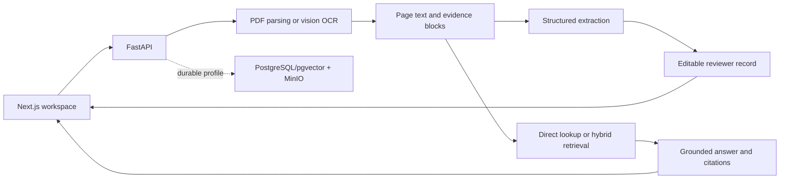

# LicenceIQ

LicenceIQ is an AI document-intelligence application for driving licences. It reads an uploaded licence, extracts source-backed fields into an editable review form, and answers questions using evidence from that document.

It was built for a 48-hour technical assessment. The included Maharashtra and Delhi licences are fictional samples only. LicenceIQ does **not** verify identity, licence authenticity, QR codes, portraits, signatures, or legal driving entitlement.

## What it demonstrates

- Upload and preview a PDF, PNG, JPG, or JPEG licence (maximum 10 MB).
- Read native PDF text or use OpenAI vision OCR for scanned/image pages.
- Extract full name, licence number, dates, address, vehicle classes, issuing authority, and other evidence-supported details.
- Show original extraction evidence beside an editable reviewer value; edits never overwrite source extraction.
- Ask direct or natural-language questions, receive cited answers, and return a clear unavailable response when evidence is missing.
- Use semantic and lexical retrieval only within the active document.
- Split a supported side-by-side two-licence image into two isolated review workspaces instead of mixing people’s data.
- Apply local NeMo Guardrails to block prompt-injection attempts and keep document Q&A in scope.

## Technology stack

| Area | Technology |
| --- | --- |
| Frontend | Next.js 16, React 19, TypeScript, CSS |
| API | Python 3.11, FastAPI, Pydantic, Uvicorn |
| Document processing | `pypdf`, `pypdfium2`, Pillow, `python-multipart` |
| AI | OpenAI Responses API with `gpt-4.1-mini`; `text-embedding-3-small` for retrieval embeddings |
| Safety and observability | NeMo Guardrails; optional Langfuse manual tracing with input/output capture disabled |
| Durable local profile | PostgreSQL + pgvector and MinIO, via Docker Compose |
| Quality tooling | Pytest, Ruff, mypy, ESLint, TypeScript, Prettier, Next.js build |

## Architecture



The application is a modular monolith: routes are thin, services own workflow rules, repositories isolate persistence, and provider adapters isolate OpenAI-specific calls.

## AI and RAG approach

1. **Read:** PDFs use native text where possible. Scanned PDFs and images are rendered within limits and sent to vision OCR.
2. **Extract:** the model returns structured fields with evidence-block IDs. LicenceIQ resolves every ID against stored reading blocks and rejects unsupported values.
3. **Review:** reviewer corrections are stored separately from immutable extraction and source evidence.
4. **Answer:** known validated fields use deterministic direct lookup. Follow-up questions can be rewritten using the preceding three questions, with the original wording retained if rewriting fails. Broader questions use bounded lexical plus semantic retrieval over blocks from the same document only.
5. **Ground:** answer citations must resolve to selected evidence, and meaningful answer terms are checked against cited source text. Otherwise the assistant returns `I couldn't find that in this document.`
6. **Guard:** input rails reject prompt-control attempts before question rewriting, embedding, retrieval, or answering. Clearly unrelated requests return LicenceIQ’s scope guidance.

## Run locally

### Prerequisites

- Python 3.11+
- [uv](https://docs.astral.sh/uv/)
- Node.js 22.13+ with npm
- Docker Desktop for the durable local profile
- An OpenAI API key for OCR, extraction, embeddings, and Q&A

Copy the local templates, then add `OPENAI_API_KEY` to the ignored root `.env`. Never commit or share that file.

```powershell
Copy-Item .env.example .env
Copy-Item frontend/.env.example frontend/.env.local
```

Start the API:

```powershell
cd backend
uv sync --frozen --python 3.11
.\scripts\start-local.ps1
```

Start the frontend in another terminal:

```powershell
cd frontend
npm.cmd ci
npm.cmd run dev
```

Open [http://127.0.0.1:3000](http://127.0.0.1:3000). API health and interactive API documentation are available at [http://127.0.0.1:8000/health](http://127.0.0.1:8000/health) and [http://127.0.0.1:8000/docs](http://127.0.0.1:8000/docs).

Use either individual fictional sample from [`samples/`](samples/) for the normal flow. The original side-by-side image can be split into two independent documents when its layout is supported.

### Full Docker profile

Docker Compose runs the frontend, API, PostgreSQL/pgvector, private MinIO, and a one-time MinIO bootstrap job. Copy [`infra/.env.example`](infra/.env.example) to ignored `infra/.env`, fill its local credentials, then run:

```powershell
Copy-Item infra/.env.example infra/.env
docker compose --env-file .env --env-file infra/.env up -d --build --wait
docker compose --env-file .env --env-file infra/.env ps
```

For unchanged stopped containers, use `docker compose ... start`. To stop without deleting local PostgreSQL/MinIO volumes, use `docker compose ... stop`. The included [`scripts/docker.ps1`](scripts/docker.ps1) provides equivalent Windows shortcuts.

## Configuration

| Variable | Needed for | Notes |
| --- | --- | --- |
| `OPENAI_API_KEY` | AI workflow | Server-only. Required for OCR, extraction, embeddings, and Q&A. |
| `LICENCEIQ_AUTH_MODE` | Access mode | `capability` is the default local assessment demo; `hybrid` and `jwt` are optional local flows. |
| `LICENCEIQ_DOCUMENT_STORAGE_BACKEND` | Bytes storage | `filesystem` for the default demo; `minio` for the durable Docker profile. |
| `LICENCEIQ_DOCUMENT_METADATA_BACKEND` | Durable data | Set to `postgres` with MinIO for metadata, evidence, vectors, and signed-user chat history. |
| `LICENCEIQ_QUESTION_GUARDRAILS_ENABLED` | Q&A rails | Defaults to `true`; disable only during local troubleshooting. |
| `LANGFUSE_*` | Optional observability/evaluation | Keep keys server-side. Tracing remains disabled until fully configured. |

See [`.env.example`](.env.example) for limits and model settings, [the JWT/MinIO guide](docs/PHASE_9_LOCAL_SETUP.md) for protected local setup, and [the Langfuse guide](docs/LANGFUSE.md) for tracing and fictional-data evaluation.

## Security and data boundaries

- Provider and storage credentials stay on the server and are excluded from Git.
- Uploads are type, structure, page/image-size, and content validated before private storage.
- For the AI workflow, bounded licence images and evidence text are sent to OpenAI for OCR, extraction, embeddings, and grounded Q&A. This is the configured external-processing boundary.
- A guest capability is scoped to one document; a JWT is scoped to one signed-in subject. Hybrid mode does not allow either credential type to access the other’s documents.
- Original extraction evidence, reviewer edits, and Q&A answers remain separate.
- In the durable profile, only the owner of a JWT-protected document can resume its saved, source-versioned chat history. Guest and capability-only chat remains ephemeral.
- Document text is evidence, never application instructions.
- Normal Langfuse tracing exports fixed operation metadata only; it does not export document content, prompts, answers, identifiers, credentials, or raw provider errors.
- The fictional Langfuse evaluation is a separate, deliberate export of fictional test inputs and results only.

## Validation and evaluation

Run the core local checks:

```powershell
cd backend
uv run pytest
uv run ruff check app tests --no-cache
```

```powershell
cd frontend
npm.cmd run lint
npm.cmd run typecheck
npm.cmd run format:check
npm.cmd run build
```

Focused typing checks are included with the changed backend components. Full `uv run mypy app` currently reports an existing protocol mismatch in observability; it is documented in the [evaluation results and limitations](docs/evaluation/QA_FIXES_2026-09-20.md).

The latest reviewed Langfuse v0 run used ten fictional cases and completed with zero errors: Recall@3 **0.9167**, Recall@5 **1.0000**, MRR **0.7083**, citation support **1.0000**, abstention accuracy **1.0000**, and direct-path accuracy **1.0000**. It uses isolated temporary storage and only the two supplied fictional samples. Read the [evaluation results and limitations](docs/evaluation/QA_FIXES_2026-09-20.md) before interpreting these scores as broader accuracy.

Five additional local question suites (22 cases) cover happy-path, semantic/contextual, unsupported, off-topic, and prompt-injection behaviour. They are review drafts under [`evaluation/fictional_question_suites_v1/`](evaluation/fictional_question_suites_v1/) and require a compatible evaluator before they are published to Langfuse.

## Key decisions

- **OCR and extraction are separate.** Reusable reading evidence makes failures inspectable and enables later review/Q&A.
- **Evidence is authoritative.** Structured JSON alone never authorizes a field or answer.
- **Known facts avoid an LLM call.** Direct field answers are deterministic, faster, and cheaper.
- **Retrieval is document-scoped.** Embeddings and lexical scoring never search another user’s or document’s content.
- **Human review preserves provenance.** Edits are valuable reviewer data, not source evidence.
- **The system is deliberately small.** A modular monolith is easier to review and appropriate for the assessment scope.

## Known limitations

- OCR quality varies with scan quality, layout, language, and small text; human review remains required.
- Citations identify source pages and evidence blocks; the UI does not provide pixel-perfect OCR bounding-box highlights.
- This application does not determine document authenticity, identity, signatures, portraits, QR payloads, or legal permission.
- NeMo Guardrails enforces the implemented document-Q&A scope and prompt-control checks. It is not a general moderation system or proof against all adversarial input.
- The Langfuse benchmark covers two fictional samples and ten reviewed questions; it is regression evidence, not a production accuracy claim.
- The local account flow has no email verification, password reset, public rate limits, audit trail, or public-production support.
- The default filesystem demo retains uploaded documents for 24 hours before cleanup; reviewers should not treat it as archival storage.
- The durable Docker profile is a local demonstration, not a deployment, backup/recovery, or multi-worker concurrency validation.
- There is no public deployment. Local setup is provided as allowed by the assessment brief.

## Demo and submission

- A captioned **5:18** local demo video is available at `dist/LicenceIQ-demo-2026-09-20-captioned.webm` in this workspace. Binary recordings are intentionally excluded from Git.
- [Demo script](docs/DEMO_SCRIPT.md) is the refreshed 6:30–7:00 recording runbook; it is longer than the existing recording.
- [Submission checklist](docs/SUBMISSION_CHECKLIST.md) covers source delivery, local setup, video review, and secret checks.

## AI-assisted development

OpenAI Codex was used for requirements analysis, implementation, testing, review, and documentation. The project’s coding-orchestrator workflow selected subagent model routes according to the size and risk of each work unit. No other AI development tool is claimed.
