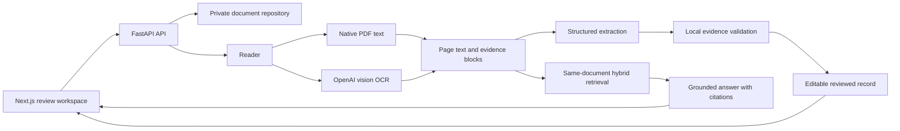

# LicenceIQ

LicenceIQ is an AI document-intelligence workspace for driving licences. A reviewer uploads one licence, reads it, checks evidence-backed extracted data, edits the reviewed record when necessary, and asks grounded questions about the same document.

The supplied Maharashtra and Delhi images are fictional test samples. LicenceIQ does not determine whether a licence, identity, signature, portrait, or QR code is genuine.

## Project overview

The complete user flow is:

```text
Upload driving licence
  -> Read native text or OCR a scanned page
  -> Extract structured, source-backed fields
  -> Auto-populate an editable review form
  -> Save reviewer corrections separately
  -> Ask grounded questions about the active document
  -> Open the cited page and evidence excerpt
```

The local application supports one licence per upload. It intentionally refuses to merge information when a file appears to contain multiple licence holders.

## Features

| Requirement | LicenceIQ behavior |
| --- | --- |
| Upload and preview | Accepts PDF, PNG, JPG, and JPEG files up to 10 MB. The backend validates type, structure, dimensions/pages, and content before storing a private temporary copy. |
| OCR and document reading | Uses native PDF text when readable. For image licences and scanned PDF pages, it renders a bounded image and uses OpenAI vision OCR. |
| Structured extraction | Extracts name, licence number, date of birth, issue/expiry dates, address, vehicle classes, issuing authority, and other directly supported fields. |
| Human review | Auto-populates an editable form. A saved review value remains separate from the original extraction and its source evidence. |
| Ask the document | Answers known field questions directly. For broader questions, it retrieves evidence only from the active document and returns an answer with citations or an explicit unavailable response. |
| Source verification | Opens the cited page and displays the exact stored evidence excerpt for fields and answers. |
| Safety and errors | Keeps provider keys server-side, returns controlled errors, expires temporary data, and never treats document text as instructions. |

## Technology stack

| Area | Technology |
| --- | --- |
| Frontend | Next.js App Router, React, TypeScript, Tailwind CSS |
| Backend | Python, FastAPI, Pydantic, pydantic-settings, Uvicorn |
| File processing | python-multipart, Pillow, pypdf, pypdfium2 |
| AI | OpenAI Responses API with `gpt-4.1-mini` for vision OCR, extraction, and grounded answers; `text-embedding-3-small` for semantic retrieval; optional local NeMo Guardrails policy checks for Q&A |
| Storage and access | Private filesystem storage for the local demo; optional MinIO/S3-compatible repository, guest document capabilities, and JWT ownership |
| Quality checks | pytest, Ruff, mypy, ESLint, TypeScript, Prettier, Next.js production build |

## Architecture



LicenceIQ is a modular monolith. API routes remain thin, services own business rules, repositories handle private persistence, and provider adapters isolate OpenAI-specific behavior. This keeps the assessment application understandable without adding a queue, vector database, or microservice platform.

## Setup and run locally

### Prerequisites

- Python 3.11+
- [uv](https://docs.astral.sh/uv/)
- Node.js 22.13+ LTS or Node.js 24 LTS with npm
- An OpenAI API key for OCR, extraction, and document Q&A

From the repository root in PowerShell:

```powershell
Copy-Item .env.example .env
Copy-Item frontend/.env.example frontend/.env.local
```

Set `OPENAI_API_KEY` in the ignored root `.env` file. Do not commit or share that file.

Start the backend in one terminal:

```powershell
cd backend
uv sync --frozen --python 3.11
uv run uvicorn app.main:app --reload --host 127.0.0.1 --port 8000
```

Start the frontend in another terminal:

```powershell
cd frontend
npm.cmd ci
npm.cmd run dev
```

Open [http://127.0.0.1:3000](http://127.0.0.1:3000). The development header should show **Backend connected**. Use one fictional individual sample from [`samples/`](samples/) to test the full workflow.

The copied environment files run the original no-login local demo. To show both **Continue as guest** and **Demo sign-in**, complete the bootstrap credential setup in the [guest and JWT guide](docs/PHASE_9_LOCAL_SETUP.md), then set both `LICENCEIQ_AUTH_MODE` and `NEXT_PUBLIC_AUTH_MODE` to `hybrid`.

- API health: [http://127.0.0.1:8000/health](http://127.0.0.1:8000/health)
- Development API documentation: [http://127.0.0.1:8000/docs](http://127.0.0.1:8000/docs)

## Environment variables

Only `OPENAI_API_KEY` is required for the complete AI workflow. The local defaults are suitable for the assessment demo.

| Variable | Required | Purpose |
| --- | --- | --- |
| `OPENAI_API_KEY` | Yes for OCR/extraction/Q&A | Server-only key for OpenAI document processing. |
| `NEXT_PUBLIC_API_BASE_URL` | No | Browser API address; defaults to `http://127.0.0.1:8000`. |
| `NEXT_PUBLIC_AUTH_MODE` | No | `capability` for the ready-to-run local demo; `hybrid` for guest plus demo sign-in; `jwt` for a signed-in workspace. It must match the backend mode. |
| `LICENCEIQ_AUTH_MODE` and `LICENCEIQ_DOCUMENT_STORAGE_BACKEND` | No | Backend switches for guest capability, JWT/hybrid access, and optional MinIO storage. |
| `LICENCEIQ_QUESTION_GUARDRAILS_ENABLED` | No | Enables local NeMo input/output policy checks for Q&A. It is `true` by default; set it to `false` only for local troubleshooting. |

All optional limits, model settings, JWT settings, and MinIO settings are documented in [`.env.example`](.env.example). See the [private JWT/MinIO setup guide](docs/PHASE_9_LOCAL_SETUP.md) before enabling those optional modes. Never put secrets in `NEXT_PUBLIC_*` variables.

The [Phase 10A durable foundation](docs/PHASE_10_PLATFORM_FOUNDATION.md) adds a local MinIO and PostgreSQL/pgvector compose configuration plus a versioned database schema. The application does not select that profile yet, so the fictional-sample demo still starts without Docker.

## Access modes

| Mode | Use case | Credential boundary |
| --- | --- | --- |
| `capability` | Default local assessment demo | Upload returns one high-entropy document capability, retained only in browser memory. |
| `hybrid` | Interview demonstration of both paths | Guests use `X-Document-Capability`; signed-in users use a short-lived JWT. The two credential types cannot access each other’s documents. |
| `jwt` | Authenticated local/production foundation | A configured bootstrap account receives a short-lived JWT; each document is bound to its token subject. |

`hybrid` is deliberately blocked in production because a public guest service also needs rate limits, malware scanning, monitoring, and other operational controls. The bootstrap account demonstrates ownership; it is not a user-registration system.

## AI and RAG approach

```text
Document -> parsing/OCR -> page text and evidence blocks
         -> strict structured extraction -> local evidence validation
         -> reviewer correction layer
         -> direct lookup or hybrid retrieval -> grounded cited answer
```

1. Each PDF page first attempts native text extraction. Image licences and unreadable PDF pages are prepared as bounded images for vision OCR.
2. Structured extraction returns values plus stable evidence block IDs. The backend resolves each ID against its own stored reading and rejects unsupported values.
3. Reviewer changes are saved beside, never inside, the original extraction.
4. Known questions such as “What is the licence number?” use the validated extracted field directly and avoid an unnecessary LLM call.
5. Broader questions use a bounded, private semantic-plus-lexical search over blocks from the active document only. A grounded answer must cite selected evidence; otherwise the application returns an unavailable response.
6. Every provider answer is checked against the cited source terms before it can be returned. Optional NeMo input/output rails reject prompt-control attempts and prompt leakage; they receive only the question or final answer, not licence text or retrieved evidence.

## Key technical decisions

- **Separate OCR from extraction.** OCR produces reusable page text; extraction converts that text into a structured licence record. This makes failures and evidence easier to inspect.
- **Keep providers behind adapters.** The application can replace the OCR, extraction, answer, or embeddings provider without changing API routes or review rules.
- **Use strict structured output.** Extraction targets a defined licence schema before local evidence validation, which keeps the review form predictable even when a field is unavailable.
- **Validate model output locally.** A JSON-shaped model response is not enough: each returned field and answer citation must resolve to stored evidence.
- **Use policy rails as a separate boundary.** Optional NeMo Guardrails run locally around document Q&A, while deterministic evidence checks remain responsible for whether an answer is supported by the document.
- **Preserve provenance.** A reviewer correction does not overwrite the source extraction or become evidence for later document Q&A.
- **Bypass the LLM for known fields.** Direct answers are faster, less expensive, and deterministic when a validated extracted field already answers the question.
- **Separate guest and signed-in credentials.** A guest capability is scoped to one temporary document; a JWT is scoped to one user subject. Hybrid mode rejects ambiguous requests and never lets an invalid JWT fall back to guest access.
- **Use a modular monolith.** It is the right level of architecture for a 48-hour assessment and avoids unnecessary infrastructure.

## Validation

Latest local verification completed successfully:

- 231 offline backend tests passed, including hybrid guest/JWT isolation, invalid-credential checks, and durable-schema migration checks.
- Ruff, formatting, strict mypy, and dependency-lock checks passed.
- ESLint, TypeScript, Prettier, and production frontend builds passed in capability, hybrid, and JWT modes.
- Live OCR, extraction, review/save, direct Q&A, paraphrased retrieval, and safe abstention were exercised using the supplied fictional samples.

Run the checks yourself:

```powershell
cd backend
uv run pytest
uv run ruff check app tests --no-cache
uv run mypy app
```

```powershell
cd frontend
npm.cmd run lint
npm.cmd run typecheck
npm.cmd run format:check
npm.cmd run build
```

Detailed evidence is available in the [phase reports](docs/), without adding their phase-by-phase history to this reviewer README.

## Known limitations

- OCR accuracy varies with scan quality, small text, tables, and languages. Visual human review remains necessary.
- Licence authenticity, portrait/signature identity, QR validation, and legal permission inference are out of scope.
- Live verification covers the supplied fictional samples; it is not a broad accuracy benchmark.
- Evidence navigation uses page and excerpt references. It cannot promise pixel-perfect OCR highlighting because the OCR provider supplies no reliable coordinates.
- The local demo uses temporary private storage. Guest document capabilities and demo JWTs remain only in browser memory; the JWT mode has one bootstrap account rather than real account management.
- MinIO support has not yet been exercised against a live server. The hybrid mode is for local demonstration and is intentionally rejected in production.
- The optional NeMo policy rails use deterministic local rules for prompt-control and prompt-leakage patterns. They complement source grounding; they are not a replacement for broader content moderation or adversarial evaluation.
- There is no public deployment. Local setup is provided, as allowed by the assessment brief.

## Production improvements

Before public deployment, replace the bootstrap account with an OIDC identity provider such as Keycloak, use Auth.js in Next.js for its secure session layer, and validate provider JWTs through JWKS in FastAPI. Also add a persistent database for accounts and metadata, live private object storage, malware scanning, per-user rate limits, encrypted backups, audit logging, monitoring, and cross-worker processing coordination. A queue and isolated parsing workers would be appropriate only after real workload demands them.

## AI-assisted development

OpenAI Codex was used for requirements analysis, implementation, review, and validation. The coding-orchestrator workflow selected an appropriate model route for bounded work based on complexity and risk. No other AI development tool is claimed.

## Demo and submission

The 5:18 captioned demo video is supplied separately from the repository; Git intentionally excludes binary recordings and local runtime artifacts. The [demo script](docs/DEMO_SCRIPT.md) and [submission checklist](docs/SUBMISSION_CHECKLIST.md) cover the requested 5–10 minute walkthrough and final delivery steps.
